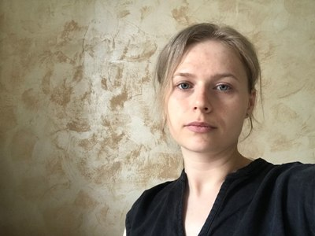

# Zhirnova Tatiana

> tel: +7-920-980-7404  
> e-mail: <farfisa@yandex.ru>  

Goals, wishes? I would like to live until tomorrow, as my grandmother used to say...  
Well, if I think about it, then I would like to complete my studies at UpSkill Me, and then we'll see.  

---

My skills:   
+ working in Google and Excel spreadsheets,  
+ cross-stitch,  
+ sign language,  
+ cooking delicious soups.  

**I do not tolerate Russian foul language.**  

---

Code examples: [this resume](https://tosonga.github.io/rsschool-cv/cv "this file").  

---

Experience: For the last 4 years I have been working with spreadsheets, writing formulas, creating reports and dashboards.  
For the last 8 years I have been sorting and recycling my waste.  
Donated blood 16 times.  

---

Education: I studied at a technical school in the specialty examination of the quality of consumer goods, at the university in the specialty social pedagogy. I also took courses in sign language for the deaf.  

---

*English level:  В1 — Intermediate*  

---
